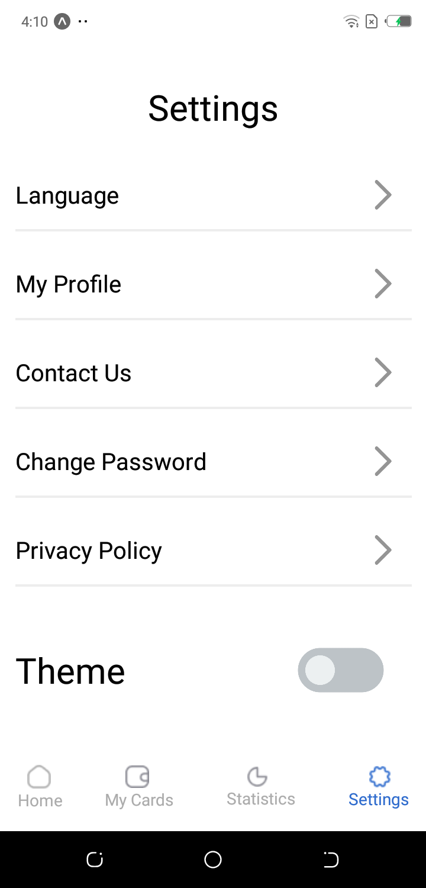

# rn-assignment5-11205670

## Brief Description of How I Built the Application

### Project Setup

Environment: I used React Native, a popular framework for building mobile applications, along with Expo, which simplifies the development and testing process.
Navigation: For navigation, I utilized @react-navigation/native and @react-navigation/stack to handle navigation between different screens of the application.

### Building the Screens

Homepage:

Created a functional component Homepage which displays user information, quick action buttons, recent transactions, and a bottom navigation bar.
Used ScrollView to make the content scrollable.
Used Image and Text components to display the static content.
Added a TouchableOpacity component to navigate to the Settings screen when the settings icon is pressed.

Settings:

Created a functional component Settings which provides options like Language, My Profile, Contact Us, Change Password, Privacy Policy, and Theme.
Used Text, View, TouchableOpacity, and Image components to structure and display the settings options.

### Theme Switching

State Management:
Used useState hook to manage the application's theme (light or dark).
Passed the theme state as a prop to both Homepage and Settings components.
Conditional Styling:
Created styles for both light and dark themes.
Applied conditional styling based on the current theme using the theme prop.
StatusBar:
Updated the StatusBar component to change its style based on the current theme.

### Navigation Integration

Set up a Stack.Navigator in the App.js to handle navigation between Homepage and Settings screens.
Used the useNavigation hook to enable navigation from within the components.

# Screenshots of App

